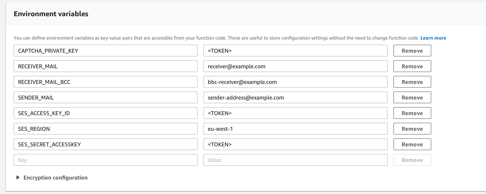
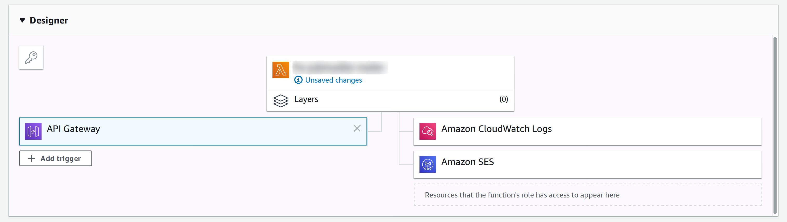
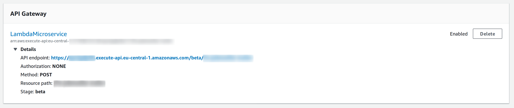

# aws-lambda-ses-recaptcha-simple-mailer

Provides a simple mail backend via AWS Lambda that uses AWS SES for sending mails and is secured via reCAPTCHA v2.

## Installation

Install all necessary dependencies via `npm install`.
Make sure to install the correct nodejs version, which is listed in `conda-requirements.txt`.

```bash
$ conda create -p ./.env --file conda-requirements.txt
$ conda activate ./.env

$ node --version
v10.13.0
$ npm --version
6.4.1
```
This module has been tested with the AWS "Node.js 10.x" runtime.

## Usage

The following variables need to be set in the AWS Lamdba function definition:

```bash
CAPTCHA_PRIVATE_KEY="YOUR_KEY_HERE"
RECEIVER_MAIL="some.mail@domain.com"       # can be multiple receivers, separate by comma
RECEIVER_MAIL_BCC="some.mail@domain.com"   # can be multiple BCC receivers, separate by comma
SENDER_MAIL="some.mail@domain.com"
SES_ACCESS_KEY_ID="YOUR_KEY_HERE"
SES_REGION="eu-west-1"                     # or any other region
SES_SECRET_ACCESSKEY="YOUR_KEY_HERE"
```

Configuration of environment variables in AWS:



Run `npm run build` in order to create a zip file in the `build` directory.
This file contains the script and all necessary modules from the `node_modules` folder.

This script has been designed to work behind a AWS Gateway's POST method. 







The API Gateway requires the client to send three properties via POST method,
with a properly set header `Content-Type: 'application/json'`:

```
{
  "subject": string,
  "message": string,
  "g-recaptcha-response": string
}
```

`subject` and `message` are both free form texts, that are used for the mail subject and its message body. 
`g-recaptcha-response` must provide the token provided by reCAPTCHA for the request.

The script will then test the token against reCAPTCHA's backend by performing an HTTP request. 
If everything worked out the response will have status code 201 with an empty response body.

In case of an error it will give one of the following responses:

| Response status  | Description  | Respnose HTTP status code  |
|---|---|---|
| CAPTCHA_INVALID  | Given captcha code was invalid  | 400   |
| CAPTCHA_FAILED  | Problem when quering the reCAPTCHA API | 500  |
| OTHER | Problem when querying AWS SES | 500  |


## Tests

While this repo does not provide a full test suite, you can test the [reCAPTCHA v2 implementation by using their test keys](https://developers.google.com/recaptcha/docs/faq#id-like-to-run-automated-tests-with-recaptcha-v2-what-should-i-do).

## Contribution

Feel free to contribute to this repository, but always make sure to exclude your `env.js` file as all private keys are 
stored in this file.
